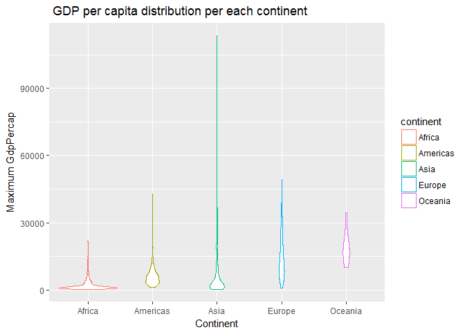
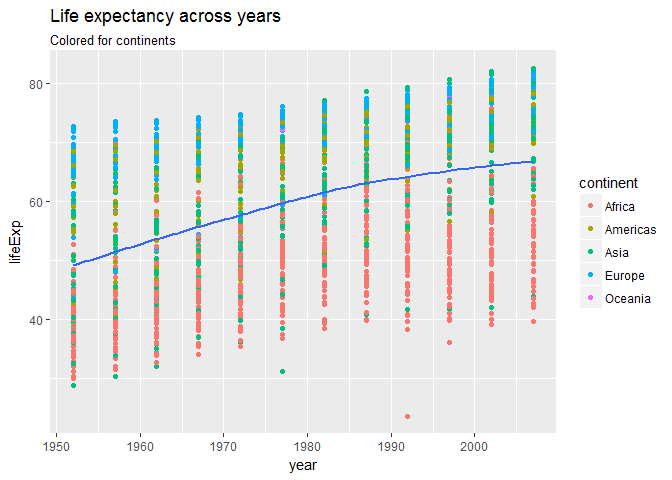
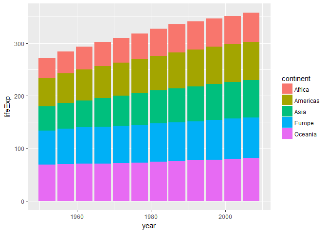
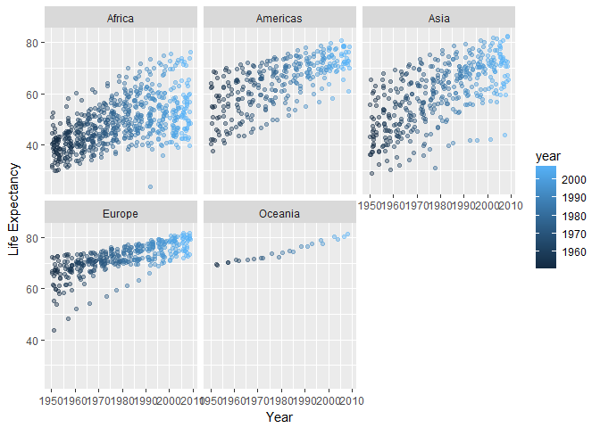

hw03-seraphinearnold
================
Seraphine Arnold

``` r
library(gapminder)
library(tidyverse)
```

The maximum and minimum of life expectancy for all continents
-------------------------------------------------------------

For this task I start by grouping the data for continents and each maximum and minimum of the GDP per capita.

``` r
gdpminmax <- gapminder %>%
  group_by (continent) %>%   
  summarize (maxgdp = max (gdpPercap), mingdp = min (gdpPercap))

knitr::kable(head(gdpminmax))
```

| continent |     maxgdp|      mingdp|
|:----------|----------:|-----------:|
| Africa    |   21951.21|    241.1659|
| Americas  |   42951.65|   1201.6372|
| Asia      |  113523.13|    331.0000|
| Europe    |   49357.19|    973.5332|
| Oceania   |   34435.37|  10039.5956|

There are many different options to visualize this. I decided to start with showing bar charts, each height of the bar chart representing the respective Maximum / Minimum of each continent.That is why I used the "geom\_col" instead of the "geom\_bar" function.

**Barchart of the Maximum GDP per capita for each continent**

``` r
gdpminmax %>% 
  ggplot(aes(continent, maxgdp, fill = continent)) +
  geom_col() +xlab("Continent") + ylab("Maximum GdpPercap") +
  ggtitle("Maximum GDP per capita for each continent")
```


**Barchart of the Minimum GDP per capita for each continent**

``` r
gdpminmax %>% 
  ggplot(aes(continent,mingdp,fill=continent)) +
  geom_col() +xlab("Continent") + ylab("Minimum GdpPercap") +
  ggtitle("Minimum GDP per capita for each continent")
```


By only seeing Barcharts which heighs show the Maximum and Minimum of the GDP of each Continent, we get an idea that the destribution and standard deviation among continents differs. For example, Asia has the highest Maximum but at the same time the second lowest Minimum shortly before Africa. To be able to see the distribution a bit better and have more information in one chart, I will employ a violin chart as well.

**Violinchart of the Maximum GDP per capita for each continent**

``` r
gapminder %>% 
  ggplot(aes(continent,gdpPercap,color=continent)) +
  geom_violin() + xlab("Continent") + ylab("Maximum GdpPercap") +
  ggtitle(" GDP per capita distribution per each continent")
```



Look at the spread of GDP per capita within the continents.
-----------------------------------------------------------

**Creating a Boxplot for GDP per Capita in each continent**

``` r
b <- ggplot(gapminder, aes(continent, gdpPercap)) +
  scale_y_log10()
```

``` r
b + geom_boxplot()
```


With the GDP per capita on the y axes, we can see how big the distribution is and where the mean of each continent lies. The boxplot is useful if you want to compare continents with each other and saves space. Africa has the lowest mean of GDP per capita, Oceania the highest. The biggest differences within one conintent can be found amongst Asia.

**Employing a combination of a violin and jitter plot for GDP per Capita in each continent**

``` r
ggplot(gapminder, aes(continent, gdpPercap)) + 
  geom_violin() + 
  geom_jitter(alpha=0.3) + 
  scale_y_log10()
```


This combination of a violin and jitter plot is extremely helpful for getting a deeper understanding of the data. It gives more information than a boxplot the boxplot that I emploxed before and makes obvious, how the GDP per capitas are distributed among the continents.

How is life expectancy changing over time on different continents?
------------------------------------------------------------------

For this I got inspired by a Blogpost from Hadley Wickham: [R Studio Blog](http://rmarkdown.rstudio.comhttps://blog.rstudio.com/2016/11/14/ggplot2-2-2-0/).

``` r
ggplot(gapminder, aes(year, lifeExp)) +
  geom_point(aes(color = continent)) +
  geom_smooth(se = FALSE, method = "loess") +
  labs(
    title = "Life expectancy across years",
    subtitle = "Colored for continents")
```



Thanks to the loess line we can see that the life expectancy overall increases throughout the years. The distribution of different life expectancies in different regions per year shows the tendency that the countries of some continents tend to have higher life expecancies than those of others (for example of Africa, shown in red). But the overlapping points make it kind of hard to differentiate between the countries well. That is why I tried another chart:

``` r
avg_lifeExp <- gapminder %>%
  group_by(year, continent) %>%
  summarise(lifeExp = mean(lifeExp)) %>%
  ungroup() %>%
  mutate(lifeExp_rel = lifeExp - mean(lifeExp))
```

    ## Warning: package 'bindrcpp' was built under R version 3.4.4

``` r
ggplot(avg_lifeExp) +
  geom_col(aes(x = year, y = lifeExp, fill = continent))
```



This graph shows the relative life expectancy of every continent. The countries are a bit easier to differentiate that way. Nevertheless, I am still not too happy with it and think there is a better way to differentiate the different countries and show how it looks inside them over time. To achieve this, I employ the "facet" function:

``` r
gapminder %>% 
  ggplot(aes(year,lifeExp, color = year)) +
  geom_jitter(alpha=0.4) +
  facet_wrap( ~ continent) +
  labs(x = "Year", y = "Life Expectancy")
```



This chart shows the different data point, colored by years and sorted in different graphs by continents.We can get an idea about the destribution and the number of observations (e. g. Oceana has much fewer cases than the other continents).
